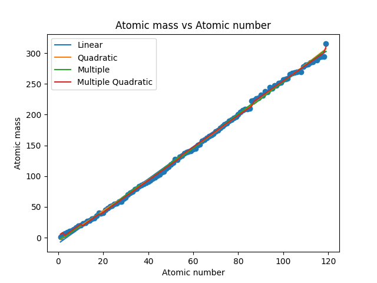

# Element Mass Prediction

## Introduction
This project is a simple demonstration of ML models.
In this case, I attempt to approximate the mass number of chemical elements using linear, polynomial, and multiple regression.
The dataset used in this project is the periodic table of elements (credits to [Bowserinator](https://github.com/Bowserinator/Periodic-Table-JSON)).

## Models
Four different regression models will be used with the following input features:
1. `linear`: atomic number
2. `quadratic`: atomic number and its square
3. `multiple`: atomic number and period
4. `multiple quadratic`: atomic number and period, and their squares

## Running the project
To run the project, simply run the `main.py` file
```bash
python main.py
```

## Results

The root mean squared error (RMSE) for each model is as follows:
1. `linear`: 3.64
2. `quadratic`: 3.07
3. `multiple`: 3.22
4. `multiple quadratic`: 2.25

The `multiple quadratic` model has the lowest RMSE, which means it is the best model for approximating the mass number of chemical elements.

## Conclusion
From the weights of the `multiple quadratic` model, we can approximate the mass number of chemical elements using the formula:
$$A = 2.64Z + 1.26P^2 - 11.25P + 13.04$$
Where:
- $A$ is the mass number
- $Z$ is the atomic number
- $P$ is the period
